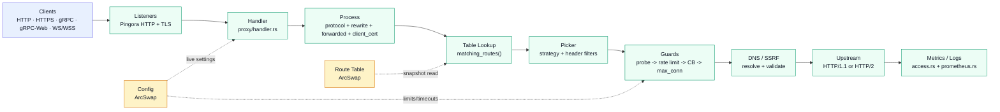
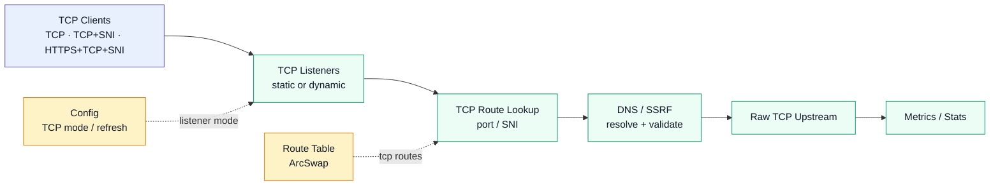
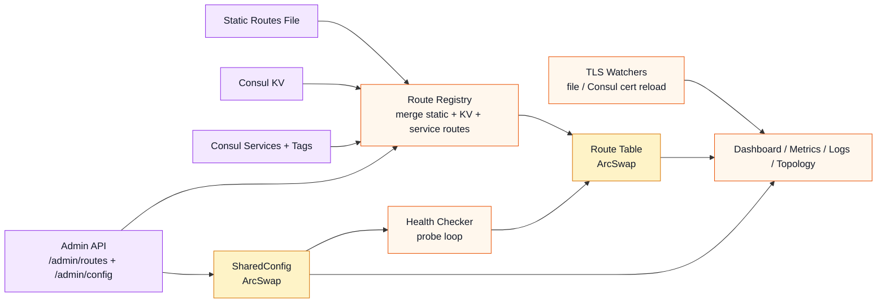
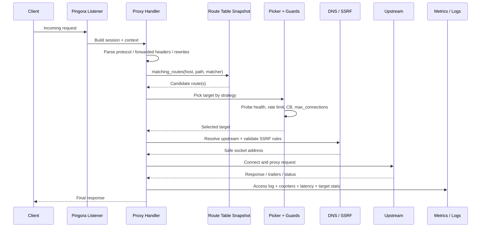

# Sentirum LB

[](https://github.com/sentirum/sentirum-lb/actions/workflows/ci.yml)
[](LICENSE)

High-performance Rust load balancer inspired by [Fabio](https://github.com/fabiolb/fabio), built on Cloudflare's [Pingora](https://github.com/cloudflare/pingora) framework.

Sentirum LB watches Consul and/or a static routes file, builds an in-memory route table, and proxies traffic to matching upstreams with lock-free hot-path lookups. Default behavior is **Consul-first**: start without a config file and rely on built-in defaults plus CLI overrides. All major operational settings are hot-reloadable at runtime via the admin API — no restart required for balancing strategy, timeouts, circuit breaker tuning, health checks, rate limits, or DNS cache TTL changes.

## Introduction

Sentirum LB is designed for teams that want **Fabio-style dynamic routing** with a more modern Rust data plane. It combines:

- **Pingora** for high-performance proxying
- **Consul** for route and service discovery
- **ArcSwap** for immutable, lock-free route table reads
- **Operational controls** like hot-reload, health checks, circuit breakers, and live admin visibility

The core design goal is simple: keep the **request hot path lean** while making the **control plane dynamic**.

## At a Glance

| Topic | Summary |
|-------|---------|
| **Best for** | Fabio-style Consul environments, protocol-aware ingress, and high-throughput Rust deployments |
| **Control plane** | Consul KV, Consul service discovery, static route files, and admin API |
| **Data plane** | Pingora-based HTTP/HTTPS, gRPC/gRPCS, gRPC-Web, WebSocket/WSS, and raw TCP |
| **Runtime changes** | Route updates, config tuning, cert reloads, metrics, logs, and topology inspection without restart |
| **Operations** | Embedded dashboard, Prometheus metrics, SSE streams, health visibility, and certificate inspection |

---

## Table of Contents

| | Section | Description |
|---|---------|------------|
| 🚀 | [**Introduction**](#introduction) | What it is, where it fits, and the design goal |
| ⚡ | [**Quick Start**](#quick-start) | Build, configure, and run in minutes |
| 📦 | [**Installation**](#installation) | Requirements, build modes, Docker workflow |
| 📋 | [**Features**](#features) | Routing, balancing, protocols, resilience |
| ⚙️ | [**Configuration**](#configuration) | Full config reference — [TLS](#tls) · [Multi-TLS](#multi-tls) · [TCP](#tcp-modes) |
| 🛤️ | [**Route Format**](#route-format) | Fabio-style commands — [Options](#route-options) |
| 🔄 | [**Consul Integration**](#consul-integration) | KV watching, service discovery |
| 🔧 | [**Admin API**](#admin-api) | Endpoints, hot-reload — [Hot-Reloadable Settings](#hot-reloadable-settings) |
| 📊 | [**Metrics**](#metrics) | Prometheus counters, gauges, histograms |
| 🔒 | [**Security**](#security) | SSRF protection, auth, rate limiting |
| 🏗️ | [**Architecture Reference**](#architecture-reference) | Diagrams — [HTTP Path](#http--https-data-path) · [TCP Path](#tcp-data-path) · [Control Plane](#control-plane-and-discovery) |
| 📁 | [**Project Layout**](#project-layout) | Source tree and module responsibilities |
| 🛠️ | [**Development**](#development) | Testing, benchmarks, CI |
| 🚚 | [**Deployment**](#deployment) | Docs, rollout flow, Nomad template |
| 🚢 | [**Production Status**](#production-status) | What's battle-tested, what's coming |
| 📚 | [**Full Configuration Reference**](#full-configuration-reference) | Complete `config.toml` reference |
| 📜 | [**License**](#license) | MIT |

---

## Highlights

- **Lock-free hot path** — `arc-swap` immutable route table snapshots; zero-lock reads on every request
- **Protocol-aware** — HTTP/HTTPS, gRPC/gRPCS (unary + streaming), gRPC-Web bridge, WebSocket/WSS
- **Resilience** — per-target circuit breaker, active health checking (HTTP/TCP probes), token-bucket rate limiting
- **Multi-TLS** — primary + additional TLS endpoints with independent certs, mTLS, and file-based hot-reload
- **Fabio-compatible** — route tags, Consul KV/service discovery, TCP modes (`tcp`, `tcp+sni`, `https+tcp+sni`, `tcp-dynamic`)
- **Live ops** — embedded dashboard, Prometheus metrics, SSE streams, runtime config hot-reload

---

## Quick Start

**Prerequisites:** Rust 1.94+ (pinned in `rust-toolchain.toml`). No external `protoc` needed — vendored via `protoc-bin-vendored`.

### 1) Build

```bash
cargo build --release
```

### 2) Run with static routes

```bash
cargo run -- --routes routes.txt
```

Example `routes.txt`:

```text
route add webapp example.com/ http://127.0.0.1:8080/
route add api example.com/api/ http://127.0.0.1:9090/ opts "strip=/api"
```

### 3) Run with Consul

```bash
cargo run -- --listen :9999 --consul 127.0.0.1:8500 --log-level info
```

### 4) Open the admin UI

- Dashboard: `http://127.0.0.1:9998/admin/`
- Metrics: `http://127.0.0.1:9998/admin/metrics`
- Health: `http://127.0.0.1:9998/admin/health`

---

## Installation

### Requirements

- Rust 1.94+ (pinned via `rust-toolchain.toml`)
- Linux/macOS development environment
- Optional: Consul for dynamic discovery
- Optional: Docker / Nomad for deployment workflows

### Build modes

```bash
# Development build
cargo build

# Release build
cargo build --release
```

### Docker

```bash
docker build -t sentirum-lb .
```

### Test and lint locally

```bash
cargo fmt
cargo clippy -- -D warnings
cargo test
```

## Features

| Category | Features |
|----------|----------|
| **Routing** | Fabio-style commands, live addition via admin API, `prefix`/`iprefix`/`glob`/`exact` matchers, header-based routing, path rewrite (`strip`/`prepend`), host override |
| **Balancing** | Round-robin, random, least-connections; weighted targets with weighted interleaving |
| **Protocols** | HTTP, HTTPS, gRPC, gRPCS, gRPC-Web bridge, WebSocket, WSS, raw TCP (tcp/tcp+sni/https+tcp+sni/tcp-dynamic) |
| **Resilience** | Per-target circuit breaker (closed/open/half-open), active health checks (HTTP/TCP probes), per-target rate limiting (token bucket) |
| **TLS** | File or Consul KV sources, multi-listener, mTLS with identity forwarding, SNI-based cert selection, file-based hot-reload (30s poll) |
| **Discovery** | Consul KV route watching, Consul service discovery via `urlprefix-` tags, service whitelist/blacklist, health status filtering |
| **Observability** | Prometheus metrics, SSE streams, per-target stats, circuit breaker state gauges, access logging |
| **Operations** | Embedded admin dashboard, runtime config hot-reload, live route addition/deletion, DNS caching (positive + negative TTL) |
| **Security** | SSRF protection, admin token auth, session management, login rate limiting, trusted proxy CIDRs |

---

## Configuration

Sentirum LB can run with **defaults only**, with **CLI overrides**, or with a full `config.toml`. A config file is recommended once you enable TLS, service discovery, mTLS, or runtime policy tuning.

Minimal `config.toml`:

```toml
[server]
listen = ":9999"
admin_listen = "127.0.0.1:9998"
admin_token = "change-me"
workers = 0
drain_timeout = "30s"

[consul]
address = "127.0.0.1:8500"
kv_prefix = "/sentirum-lb/routes"
tag_prefix = "urlprefix-"
poll_interval = "3s"

[proxy]
strategy = "round-robin"
matcher = "prefix"
connect_timeout = "5s"
read_timeout = "30s"            # non-streaming read timeout (see stream_read_timeout)
write_timeout = "30s"
idle_timeout = "120s"
pool_size = 128
max_connections = 10000

# TCP keepalive on pooled connections (Issue #22) — detects/evicts silently-dead
# connections so non-idempotent (POST/PUT/PATCH) requests are not black-holed.
# Format: "idle,interval,count". Empty disables.
upstream_tcp_keepalive = "15s,5s,3"     # LB -> backend pooled connections
downstream_tcp_keepalive = "15s,5s,3"   # edge/CDN -> LB accepted connections
upstream_user_timeout = "30s"           # TCP_USER_TIMEOUT (Linux); bounds unacked writes

# Streaming responses (WebSocket / SSE text/event-stream / long-poll) keep this
# longer read timeout; non-streaming requests use read_timeout above.
# Per-route override: add `readtimeout=120s` to a target's options.
stream_read_timeout = "3600s"

# Circuit breaker
circuit_breaker_enabled = true
circuit_breaker_error_threshold = 50
circuit_breaker_window_size = 100
circuit_breaker_recovery_timeout = 30
circuit_breaker_half_open_max = 3

# Health checking
health_check_interval = "10s"
health_check_timeout = "5s"
health_check_fall = 3
health_check_rise = 2
health_check_path = "/health"

# Rate limiting (per-target, 0 = disabled)
rate_limit_per_target = 0
rate_limit_burst = 0

# DNS cache
dns_cache_ttl = 30
dns_negative_cache_ttl = 10

[logging]
level = "info"
format = "text"
```

See the [full config reference](#full-configuration-reference) below for all options.

### TLS

Two downstream TLS modes:

```toml
# File mode — PEM files with automatic hot-reload
[tls]
source = "file"
listen = ":443"
cert_path = "/etc/sentirum-lb/cert.pem"
key_path = "/etc/sentirum-lb/key.pem"

# Consul KV mode — watches keys like /fabio/cert/example.com.pem
[tls]
source = "consul_kv"
listen = ":443"
consul_cert_prefix = "/fabio/cert"
strict_sni = false
```

### Multi-TLS

Additional TLS endpoints can run on the same LB instance with independent certificates and optional mTLS:

```toml
[[tls_listeners]]
listen = ":8443"
source = "file"
cert_path = "/etc/sentirum-lb/mtls-cert.pem"
key_path = "/etc/sentirum-lb/mtls-key.pem"
client_auth = "required"
client_ca_path = "/etc/sentirum-lb/client-ca.pem"
```

### mTLS Identity Forwarding

Verified client certificate fields are sent upstream as headers:

```
X-Client-Cert-Verified, X-Client-Cert-Serial, X-Client-Cert-Common-Name,
X-Client-Cert-Organization, X-Client-Cert-Subject, X-Client-Cert-SHA256
```

### TCP Modes

```toml
[tcp]
mode = "tcp"              # Raw TCP listener
listen = ":4222"

[tcp]
mode = "tcp+sni"          # SNI-aware TCP passthrough
listen = ":443"

[tcp]
mode = "https+tcp+sni"    # HTTPS + TCP multiplexed on one listener

[tcp]
mode = "tcp-dynamic"      # Dynamic listeners from route table
refresh = "5s"
```

Service-discovery TCP tags (Fabio-compatible):

```text
urlprefix-:4222 proto=tcp
urlprefix-nats.example.com proto=tcp
```

---

## Route Format

Fabio-style commands:

```text
route add <service> <src> <dst>
route add <service> <src> <dst> weight <w>
route add <service> <src> <dst> tags "v1,canary"
route add <service> <src> <dst> opts "strip=/api prepend=/v2 tlsskipverify=true"
route del <service>
route weight <service> <src> weight <w>
```

Examples:

```text
route add webapp myhost.com/ http://127.0.0.1:8080/
route add api myhost.com/api/ http://127.0.0.1:9090/ weight 0.7
route add static static.example.com/static/ http://127.0.0.1:3000/ opts "strip=/static"
route add grpc / grpc://10.0.0.10:50051/
route add ws /socket ws://10.0.0.20:8080/socket
route add canary api.example.com/ http://10.0.0.2:8080/ opts "header=x-version:v2"
```

### Route Options

| Option | Description |
|--------|-------------|
| `strip=/prefix` | Remove path prefix before proxying |
| `prepend=/prefix` | Add path prefix before proxying |
| `tlsskipverify=true` | Bypass upstream TLS verification (use with caution — prefer trusted CAs) |
| `ssrfskipverify=true` | Bypass SSRF checks for this target |
| `host=example.internal` | Override upstream Host header and TLS SNI |
| `proto=https\|grpc\|grpcs\|ws\|wss\|tcp` | Override upstream transport protocol |
| `header=X-Name:value` | Require matching header for this target (multiple allowed) |
| `ratelimit=X burst=Y` | Override per-target rate limit |

---

## Consul Integration

Routes are built from:

- **Consul KV** under `consul.kv_prefix`
- **Consul service discovery** using `urlprefix-` tags

Fabio-compatible tag semantics:

```text
urlprefix-/api                        # catch-all path route
urlprefix-example.com/api             # host-specific path route
urlprefix-/ proto=https strip=/api    # with options
urlprefix-/ proto=grpc                # gRPC upstream
urlprefix-example.com/realtime proto=wss  # WebSocket
```

---

## Admin API

Default bind: `127.0.0.1:9998`. For non-loopback binds, `admin_token` is required.

**Authentication options:**
- `Authorization: Bearer <token>`
- `X-Admin-Token: <token>`
- Session login via `POST /admin/login` for the embedded dashboard

### Endpoints

| Method | Path | Description |
|--------|------|-------------|
| `GET` | `/admin/` | Embedded dashboard SPA |
| `GET` | `/admin/health` | Health check |
| `GET` | `/admin/routes` | Route table inspection |
| `POST` | `/admin/routes` | Live route addition |
| `DELETE` | `/admin/routes/static` | Clear static routes |
| `GET` | `/admin/config` | Runtime config (JSON) |
| `PUT` | `/admin/config` | Hot-reload proxy settings |
| `POST` | `/admin/config/reset` | Reset to startup config |
| `GET` | `/admin/metrics` | Prometheus text metrics |
| `GET` | `/admin/metrics/stream` | Live metrics (SSE) |
| `GET` | `/admin/targets` | Per-target health, CB state, stats |
| `GET` | `/admin/targets-metrics` | Per-target Prometheus metrics |
| `GET` | `/admin/certs` | TLS certificate status |
| `POST` | `/admin/certs/reload` | Manual certificate reload |
| `GET` | `/admin/dns-cache` | DNS cache stats and entries |
| `GET` | `/admin/consul-status` | Consul watcher state |
| `GET` | `/admin/topology` | Route topology graph data |
| `GET` | `/admin/logs` | Recent log entries |
| `GET` | `/admin/logs/stream` | Live log stream (SSE) |
| `POST` | `/admin/login` | Authenticate |
| `POST` | `/admin/logout` | Invalidate session |
| `GET` | `/admin/me` | Current session info |

### Hot-Reloadable Settings

Changed via `PUT /admin/config` without restart:

`proxy.strategy`, `proxy.matcher`, `proxy.*_timeout`, `proxy.max_connections`, `proxy.circuit_breaker_*`, `proxy.health_check_*`, `proxy.rate_limit_*`, `proxy.dns_cache_*`, `proxy.upstream_h2_*`, `logging.level`, `logging.format`

**Require restart:** `pool_size`, `enable_h2c`, `trusted_proxies`, `server.*`, `consul.*`, `tls.*`

---

## Metrics

Prometheus endpoint: `GET /admin/metrics`

| Metric | Type | Description |
|--------|------|-------------|
| `sentirum_lb_requests_total` | Counter | Total requests processed |
| `sentirum_lb_requests_error` | Counter | Failed requests |
| `sentirum_lb_grpc_requests` | Counter | gRPC requests |
| `sentirum_lb_grpc_web_requests` | Counter | gRPC-Web bridged requests |
| `sentirum_lb_websocket_requests` | Counter | WebSocket upgrades |
| `sentirum_lb_active_connections` | Gauge | Current active connections |
| `sentirum_lb_route_count` | Gauge | Registered routes |
| `sentirum_lb_target_count` | Gauge | Registered targets |
| `sentirum_lb_request_duration_seconds` | Histogram | Request latency |
| `sentirum_lb_status_codes_total` | Counter | Responses by status code |
| `sentirum_lb_target_circuit_breaker_state` | Gauge | CB state per target (0=closed, 1=half-open, 2=open) |

Process metrics from `/proc`: resident memory, virtual memory, open file descriptors.

---

## Security

- **SSRF protection** — loopback, link-local, RFC1918 (unless Consul-sourced), multicast, CGNAT, documentation, benchmark, and other reserved IP ranges are blocked by default
- **Admin auth** — bearer token or session-based access, login rate limiting (5 attempts / 60s / username), configurable session lifetime, and loopback-safe defaults
- **Trusted proxies** — CIDR-based `X-Forwarded-For` and `CF-Connecting-IP` handling to avoid spoofed client IPs
- **TLS** — SNI-based certificate selection, optional strict SNI mode, mTLS with verified client identity forwarding
- **Operational guardrails** — runtime config validation, DNS cache revalidation, circuit breaker fallback, and certificate reload inspection via admin endpoints

---

## Architecture Reference

The diagrams below reflect **Sentirum LB's real split between request hot path, TCP forwarding, and the dynamic control plane**.

### Diagram Legend

| Color | Meaning |
|-------|---------|
| 🟦 Blue | External clients / users |
| 🟩 Green | Data-plane request handling |
| 🟨 Yellow | Shared live state (`ArcSwap<Config>`, `ArcSwap<Table>`) |
| 🟧 Orange | Control-plane services / background loops |
| 🟪 Purple | Discovery or source inputs |

### HTTP / HTTPS Data Path



### TCP Data Path



### Control Plane and Discovery



### Request Lifecycle (HTTP / HTTPS / gRPC path)



### How to read the diagrams

1. **HTTP hot path** is intentionally narrow: listener → handler → route lookup → picker → guards → DNS/SSRF → upstream.
2. **TCP path** shares route state and safety checks, but does not go through `SentirumProxy`; forwarding lives in `src/proxy/tcp.rs`.
3. **Route changes** are rebuilt off-path: static file, Consul KV, service discovery, and admin route changes feed `RouteRegistry`, which atomically swaps a fresh immutable table.
4. **Runtime config** is live via `ArcSwap<Config>`, so strategy, timeouts, CB settings, health checks, and rate limits can change without restart.
5. **Health checks** run asynchronously and only feed target health state back into admission.
6. **TLS state** is maintained separately by file/Consul-backed watchers and selectors; request routing begins after accept/handshake.
7. **Observability** is side-band: metrics, logs, dashboard state, and topology views are updated from callbacks and background state, not by mutating the route table.

### Architecture Reference Tables

#### Request Path

| Feature | Config | Admin API | Hot-Reload | Source |
|---------|--------|-----------|:----------:|--------|
| Route matching | `proxy.matcher` | `PUT /admin/config` | ✅ | [`src/route/table.rs`](src/route/table.rs) |
| Balancing strategy | `proxy.strategy` | `PUT /admin/config` | ✅ | [`src/route/picker.rs`](src/route/picker.rs) |
| Header routing | route `opts "header="` | — | — | [`src/proxy/handler/upstream.rs`](src/proxy/handler/upstream.rs) |
| Path rewrite | route `opts` | — | — | [`src/proxy/handler/rewrite.rs`](src/proxy/handler/rewrite.rs) |
| Protocol detection | — | — | — | [`src/proxy/handler/protocol.rs`](src/proxy/handler/protocol.rs) |
| gRPC-Web bridge | — | — | — | [`src/proxy/handler/protocol.rs`](src/proxy/handler/protocol.rs) |
| WebSocket handling | — | — | — | [`src/proxy/handler.rs`](src/proxy/handler.rs) |
| Forwarded headers | `proxy.trusted_proxies` | — | ❌ | [`src/proxy/handler/forwarded.rs`](src/proxy/handler/forwarded.rs) |
| SSRF protection | — | — | — | [`src/route/target.rs`](src/route/target.rs) |
| DNS cache | `proxy.dns_cache_ttl` | `GET /admin/dns-cache` | ✅ | [`src/route/dns_cache.rs`](src/route/dns_cache.rs) |
| Circuit breaker | `proxy.circuit_breaker_*` | `PUT /admin/config` | ✅ | [`src/route/circuit_breaker.rs`](src/route/circuit_breaker.rs) |
| Health checking | `proxy.health_check_*` | `PUT /admin/config` | ✅ | [`src/proxy/health.rs`](src/proxy/health.rs) |
| Rate limiting | `proxy.rate_limit_*` | `PUT /admin/config` | ✅ | [`src/proxy/ratelimit.rs`](src/proxy/ratelimit.rs) |
| Access logging | `logging.*` | `GET /admin/logs/stream` | ✅ | [`src/proxy/handler/access.rs`](src/proxy/handler/access.rs) |

#### TLS and TCP

| Feature | Config | Admin API | Hot-Reload | Source |
|---------|--------|-----------|:----------:|--------|
| TLS termination | `tls.*` | `GET /admin/certs` | — | [`src/proxy/tls/`](src/proxy/tls/) |
| TLS hot-reload | `tls.source = "file"` | `POST /admin/certs/reload` | ✅ | [`src/proxy/tls/watcher.rs`](src/proxy/tls/watcher.rs) |
| Multi-TLS | `[[tls_listeners]]` | — | — | [`src/proxy/tls/config.rs`](src/proxy/tls/config.rs) |
| mTLS / client auth | `tls.client_auth` | — | — | [`src/proxy/handler/client_cert.rs`](src/proxy/handler/client_cert.rs) |
| TCP proxy | `tcp.*` | — | — | [`src/proxy/tcp.rs`](src/proxy/tcp.rs) |

#### Control Plane and Discovery

| Feature | Config | Admin API | Hot-Reload | Source |
|---------|--------|-----------|:----------:|--------|
| Route parsing | — | `POST /admin/routes` | — | [`src/route/parser.rs`](src/route/parser.rs) |
| Route registry | `consul.*` | `GET /admin/routes` | — | [`src/route/registry.rs`](src/route/registry.rs) |
| Consul KV | `consul.kv_*` | — | — | [`src/consul/watcher.rs`](src/consul/watcher.rs) |
| Consul services | `consul.service_*` | `GET /admin/consul-status` | — | [`src/consul/watcher.rs`](src/consul/watcher.rs) |
| Config hot-reload | — | `PUT /admin/config` | ✅ | [`src/admin/config_handler.rs`](src/admin/config_handler.rs) |
| Admin auth | `server.admin_token` | `POST /admin/login` | — | [`src/admin/auth.rs`](src/admin/auth.rs) |
| Dashboard | — | `GET /admin/` | — | [`src/admin/dashboard.html`](src/admin/dashboard.html) |
| Prometheus metrics | — | `GET /admin/metrics` | — | [`src/metrics/prometheus.rs`](src/metrics/prometheus.rs) |

## Project Layout

```
src/
├── main.rs                  # Bootstrap, config, Pingora server setup
├── config/                  # Configuration model, defaults, validation
├── proxy/
│   ├── handler.rs           # Hot-path request handling
│   ├── handler/             # upstream, rewrite, protocol, forwarded, client_cert, access
│   ├── health.rs            # Active health checking
│   ├── ratelimit.rs         # Token bucket rate limiter
│   ├── tcp.rs               # Raw TCP proxy modes
│   └── tls/                 # TLS config, selector, watcher, helpers, ocsp
├── route/
│   ├── table.rs             # Immutable route table + lookup
│   ├── registry.rs          # Route source merging (static, KV, services)
│   ├── parser.rs            # Fabio-style route command parser
│   ├── definition.rs        # Route/target model
│   ├── target.rs            # Target struct, SSRF, DNS resolution
│   ├── picker.rs            # Balancing strategies
│   ├── circuit_breaker.rs   # Circuit breaker per target
│   ├── health_tracker.rs    # Probe health + CB combined tracker
│   ├── dns_cache.rs         # DNS cache with TTL
│   └── target_stats.rs      # Per-target stats registry
├── admin/
│   ├── api.rs               # Router, shared state, dashboard
│   ├── auth.rs              # Sessions, login, middleware
│   ├── config_handler.rs    # Config GET/PUT/reset
│   ├── metrics_handler.rs   # Metrics, SSE, topology
│   ├── routes_handler.rs    # Routes CRUD
│   └── certs_handler.rs     # TLS cert inspection
├── consul/
│   ├── client.rs            # HTTP client, blocking queries
│   └── watcher.rs           # KV and service watchers
└── metrics/
    └── prometheus.rs        # Prometheus counters, gauges, histograms
```

---

## Development

```bash
cargo test                    # Run tests
cargo fmt                     # Format
cargo clippy -- -D warnings   # Lint
cargo build --release         # Release build
```

Useful local workflows:

```bash
cargo test --quiet            # Fast normal verification
cargo bench                   # Criterion benchmark(s)
docker/test/smoke-test.sh     # Dockerized smoke test
docker/test/edge-test.sh      # Broader edge / protocol test sweep
```

---

## Deployment

Deployment-oriented reference material lives under [`docs/`](docs/).

| File | Purpose |
|------|---------|
| [`docs/sentirum-lb.nomad.hcl`](docs/sentirum-lb.nomad.hcl) | Nomad job template |
| [`docs/fabio-migration-action-plan.md`](docs/fabio-migration-action-plan.md) | Migration approach from Fabio |
| [`docs/fabio-to-sentirum-lb-migration-table.md`](docs/fabio-to-sentirum-lb-migration-table.md) | Feature-by-feature migration table |
| [`docs/sentirum-lb-canary-checklist.md`](docs/sentirum-lb-canary-checklist.md) | Canary rollout checklist |
| [`docs/sentirum-lb-smoke-and-canary-runbook.md`](docs/sentirum-lb-smoke-and-canary-runbook.md) | Smoke + canary validation runbook |

Typical rollout flow:

1. Build and publish the binary or container image
2. Start with static routes or Consul KV routes
3. Expose admin API only on loopback or behind trusted access
4. Validate `/admin/health`, `/admin/metrics`, and dashboard connectivity
5. Run smoke / canary checks before full traffic cutover

---

## Production Status

Sentirum LB is already in **production-oriented** shape for HTTP ingress, service discovery, protocol-aware proxying, and operational visibility.

### Implemented and tested

- HTTP/HTTPS proxying
- gRPC/gRPCS proxying (unary, server streaming, client streaming, bidi streaming)
- gRPC-Web bridging
- WebSocket/WSS proxying
- TLS termination from file and Consul KV sources
- Multi-TLS listeners and mTLS client authentication
- Circuit breaker, active health checking, and per-target rate limiting
- Consul KV + Consul service discovery
- Raw TCP modes, including validation with the NATS protocol (`INFO`, `PING/PONG`, `CONNECT/SUB/PUB/UNSUB`, queue groups, 50KB payloads, 20+ concurrent connections)

### Operationally validated

- Runtime route updates
- Runtime config hot-reload
- Embedded admin dashboard + SSE streams
- Prometheus metrics export
- Live load testing across 93K+ requests and mixed protocols

**Notes:**
- OCSP stapling infrastructure is in place; handshake stapling depends on Pingora exposing `SSL_set_ocsp_resp`
- `tlsskipverify=true` is not fully reliable with Pingora's rustls upstream connector — prefer trusted/internal CA certificates

---

## Full Configuration Reference

<details>
<summary>Click to expand</summary>

```toml
[server]
listen = ":9999"                   # Proxy listen address
admin_listen = "127.0.0.1:9998"    # Admin API listen address
admin_token = "change-me"          # Admin auth token (required for non-loopback)
workers = 0                        # Pingora worker threads (0 = default)
drain_timeout = "30s"              # Graceful shutdown drain period

[[server.admin_users]]
username = "admin"
password = "bcrypt-hash"           # bcrypt password hash

[consul]
address = "127.0.0.1:8500"
scheme = "http"
token = ""
kv_prefix = "/sentirum-lb/routes"
tag_prefix = "urlprefix-"
poll_interval = "3s"
service_discovery = false
kv_watching = false
service_whitelist = []
service_blacklist = []
graceful_shutdown = true
include_warning = false            # Include "warning" health status services

[proxy]
strategy = "round-robin"           # round-robin | random | least-connections
matcher = "prefix"                 # prefix | iprefix | glob | exact
request_id_header = "X-Request-ID"
no_route_status = 404
connect_timeout = "5s"
read_timeout = "30s"                # Non-streaming read timeout (Issue #22)
write_timeout = "30s"
idle_timeout = "120s"
stream_read_timeout = "3600s"      # WebSocket/SSE/long-poll read timeout; empty = use read_timeout
upstream_tcp_keepalive = "15s,5s,3"   # Pooled LB->backend keepalive "idle,interval,count"; empty disables
downstream_tcp_keepalive = "15s,5s,3" # Accepted CDN->LB keepalive; empty disables
upstream_user_timeout = "30s"      # TCP_USER_TIMEOUT (Linux only); empty/0 = system default
enable_h2c = false                 # Accept cleartext H2 for gRPC clients
upstream_h2_max_streams = 128
upstream_h2_ping_interval = ""
pool_size = 128
max_connections = 10000            # Per-target, 0 = unlimited

# Circuit breaker
circuit_breaker_enabled = true
circuit_breaker_error_threshold = 50    # Error % to open circuit
circuit_breaker_window_size = 100       # Sliding window size
circuit_breaker_recovery_timeout = 30   # Seconds before half-open
circuit_breaker_half_open_max = 3       # Max probe requests in half-open

# Health checking
health_check_interval = "10s"
health_check_timeout = "5s"
health_check_fall = 3              # Failures before unhealthy
health_check_rise = 2              # Successes before healthy
health_check_path = "/health"
health_check_tls_skip_verify = false

# Rate limiting (per-target)
rate_limit_per_target = 0          # 0 = disabled
rate_limit_burst = 0

# DNS cache
dns_cache_ttl = 30                 # Positive cache TTL (seconds)
dns_negative_cache_ttl = 10        # Negative cache TTL (seconds)

# Trusted proxies
trusted_proxies = []               # CIDR ranges, e.g. ["173.245.48.0/20"]

[logging]
level = "info"                     # trace | debug | info | warn | error
format = "text"                    # text | json

[tls]
source = ""                        # file | consul_kv
cert_path = ""
key_path = ""
listen = ""
consul_cert_prefix = "/fabio/cert"
strict_sni = false
require_initial_snapshot = false
client_auth = ""                   # optional | required
client_ca_source = ""              # file | consul_kv
client_ca_path = ""
client_ca_consul_prefix = ""
client_ca_upgrade_cn = ""
ocsp_stapling_enabled = false

[[tls_listeners]]
listen = ":8443"
source = "file"
cert_path = "/path/to/cert.pem"
key_path = "/path/to/key.pem"
client_auth = "required"
client_ca_path = "/path/to/ca.pem"

[tcp]
mode = ""                          # tcp | tcp+sni | https+tcp+sni | tcp-dynamic
listen = ""
refresh = "5s"                     # Reconciliation interval for tcp-dynamic
```

</details>

---

## License

MIT
